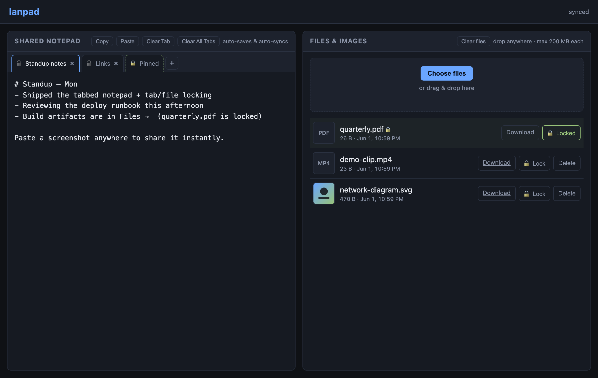

# lanpad

A tiny shared notepad for the LAN. A set of persistent, **tabbed** text areas
that everyone on the network sees and edits in near-real-time, plus a
drag-and-drop area for sharing files and images. No accounts, no logins — just
a URL.



- **Stack:** Flask 3 + gunicorn, vanilla HTML/CSS/JS (no build step)
- **Default port:** `7777` on the host → `8080` in the container
- **Data:** `./data` on the host, mounted to `/data`

## Features

- **Tabbed notepad** — multiple named tabs backed by `tabs.json`. Add a tab
  (`+`), rename it (double-click), close it (`×`), and **drag tabs to
  reorder**. Auto-saves on every keystroke (debounced ~500 ms); structural
  changes save immediately. Other browsers pick up edits within ~2 s via
  polling — no WebSockets.
- **Copy / Paste** — buttons that act on the **currently selected tab**. Copy
  uses the async clipboard API with a `document.execCommand('copy')` fallback
  so it still works on plain-HTTP LAN; paste hints "use Ctrl+V" where the async
  API is blocked.
- **Locking** — lock a **tab** (🔓/🔒 toggle) or a **file** (Lock button) to
  protect it from every clearing/deletion operation. Locked items survive
  *Clear All Tabs* / *Clear files*, can't be individually closed or deleted,
  and visibly drop their close/delete affordance.
- **Clear controls** — *Clear Tab* (active tab only), *Clear All Tabs* (keeps
  locked tabs), *Clear files*. All confirm first.
- **File / image sharing** — drop files anywhere, paste a screenshot, or click
  *Choose files*. Images get inline thumbnails and a click-to-zoom lightbox;
  everything else gets a download button.

## Running it

```bash
git clone git@github.com:sudosert/lanpad.git
cd lanpad
docker compose up -d --build
```

Then open `http://<host-ip>:7777`. Data lives in `./data/` on the host and
survives container rebuilds.

> **Upgrading from a pre-tabs version?** An older single-pad `notes.txt` is
> migrated into the first tab ("Tab 1") automatically on first run, so nothing
> is lost. Rebuild with `docker compose up -d --build` and hard-refresh open
> browser tabs — the API shape changed (`notes` → `tabs`), so a stale cached
> `app.js` won't sync against the new backend.

### Local dev (no Docker)

```bash
python -m venv .venv && . .venv/bin/activate
pip install -r requirements.txt
LANPAD_DATA_DIR=./data python app.py   # serves on :8080
```

### Environment

| Variable | Default | Meaning |
| --- | --- | --- |
| `LANPAD_DATA_DIR` | `/data` | Where to persist `tabs.json`, `file_locks.json`, and `files/`. |
| `LANPAD_MAX_UPLOAD_MB` | `200` | Per-request upload limit. |
| `LANPAD_MAX_TABS` | `30` | Maximum number of notepad tabs. |
| `PORT` | `8080` | In-container port. The compose file maps `7777:8080`. |

To change the host port, edit the left side of the mapping in
`docker-compose.yml` (`"7777:8080"`).

## HTTP API

| Method | Path | Purpose |
| --- | --- | --- |
| `GET` | `/` | Render the UI. |
| `GET` | `/api/state` | `{ tabs[], notes_mtime, files[], server_time }`. Polled every 2 s. Each tab is `{id, name, content, locked}`; each file carries a `locked` flag. |
| `POST` | `/api/notes` | Body `{ "tabs": [...] }`. Atomically replaces `tabs.json`. 400 on a non-list. |
| `POST` | `/api/upload` | Multipart upload. Field name `files` (repeatable) or `file`. |
| `GET` | `/files/<id>` | Inline serve. Append `?dl=1` for an attachment download. |
| `POST` | `/api/files/<id>/lock` | Body `{ "locked": bool }`. Protect/unprotect a file. |
| `DELETE` | `/api/files/<id>` | Remove one file. `409` if locked. |
| `DELETE` | `/api/files` | Clear all **unlocked** files; returns `{ removed, kept, files[] }`. |

## How it works

Flask serves a single page and a small JSON API.

- **Notepad state** is one `tabs.json` (`{tabs:[{id,name,content,locked}]}`),
  written atomically via a tmp-file rename. The client holds the tab array,
  shows only the active tab's text in the editor, and saves the whole array.
- **Files** are stored under `data/files/` as `<12-hex-id>__<original-name>`.
  The random prefix is both the public URL slug and a path-traversal guard —
  the download route only accepts `^[0-9a-f]{12}$`.
- **File locks** live separately in `file_locks.json` (`{locked:[id,…]}`).
- **Sync** is plain 2-second polling: the client adopts the server tab list
  only when `notes_mtime` changed *and* it isn't mid-edit, preserving the
  active tab and cursor. A `beforeunload`/`pagehide` `sendBeacon` flush guards
  the last keystrokes inside the debounce window.

```text
lanpad/
├── app.py              # Flask app + JSON API
├── templates/
│   └── index.html      # single page, two panes + tab bar
├── static/
│   ├── style.css
│   ├── app.js          # tabs, polling, uploads, locking, lightbox
│   └── favicon.svg
├── Dockerfile          # python:3.12-slim + gunicorn (2 workers)
├── docker-compose.yml  # binds ./data, port 7777:8080
└── requirements.txt    # Flask, gunicorn
```

## Security model

**Light by design.** Anyone who can reach the port can read and write
everything.

- No auth, no rate limiting, no CSRF protection.
- Filenames sanitised via `werkzeug.secure_filename`; downloads gated behind a
  random-ID route.
- Uploads capped at `LANPAD_MAX_UPLOAD_MB`.
- **Locking is a footgun guard, not a permission** — it stops accidental
  clears, but anyone can unlock anything.

If sensitive data starts living here, put it behind a reverse proxy with basic
auth or use a different tool.

## License

[MIT](LICENSE) © Aodhan Collins
